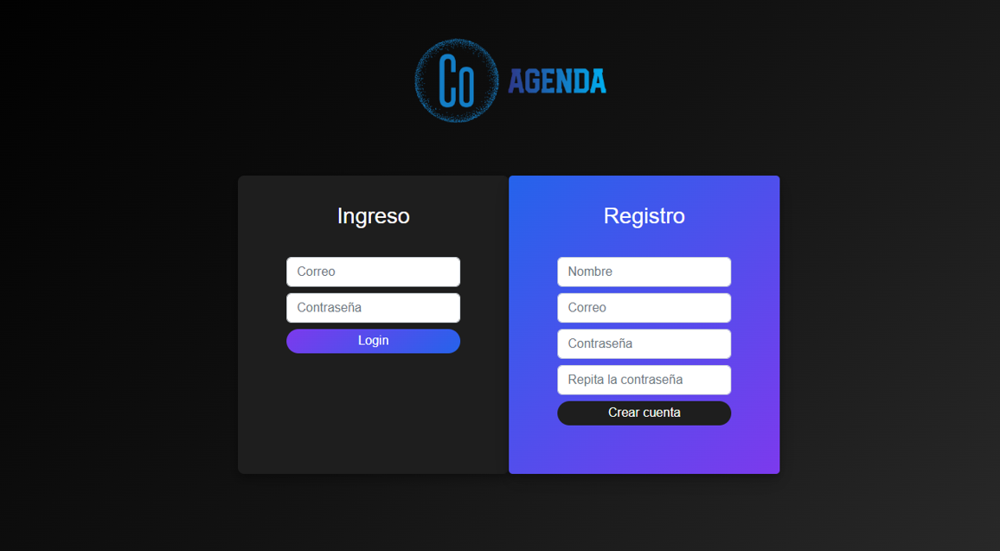
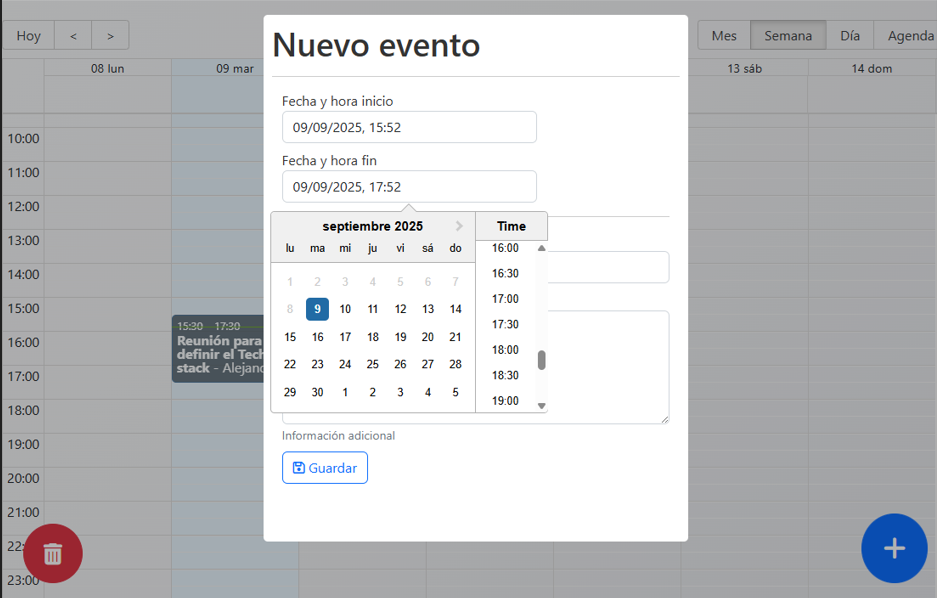

# 📅 CO-Agenda - Calendario de Eventos

CO-Agenda es una aplicación web que permite a múltiples usuarios **registrar y gestionar eventos** en un calendario compartido.  
Cada usuario puede agregar eventos con **título, hora, fecha y notas**, y todos los datos se gestionan mediante **MongoDB**.

🔗 **Demo en vivo**: [https://co-agenda-frontend.vercel.app/auth/login](https://co-agenda-frontend.vercel.app/auth/login)  
🌐 **Portafolio**: [https://portfolio-drab-six-76.vercel.app/](https://portfolio-drab-six-76.vercel.app/)

---

## ✨ Características principales

- 🗓️ Registro de múltiples usuarios con autenticación.  
- 📝 Creación y gestión de eventos con título, fecha, hora y notas.  
- 🔄 Actualización y eliminación de eventos.  
- 📊 Visualización de eventos en un calendario interactivo con **React Big Calendar**.  
- ✅ Alertas y confirmaciones con **SweetAlert2**.  
- 📦 Manejo del estado global con **Redux Toolkit**.  
- 🌐 Consumo de API con **Axios** y almacenamiento en **MongoDB**.  

---

## 🛠️ Tecnologías utilizadas

- **React 19** + **TypeScript**  
- **Vite**  
- **Redux Toolkit** / **React Redux**  
- **React Big Calendar** 
- **React Datepicker** 
- **React Modal** 
- **Axios** 
- **SweetAlert2**  
- **MongoDB** 

---

## 📸 Vista previa

